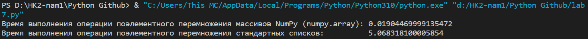
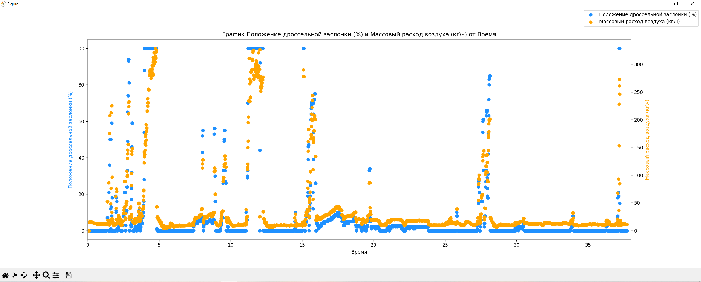
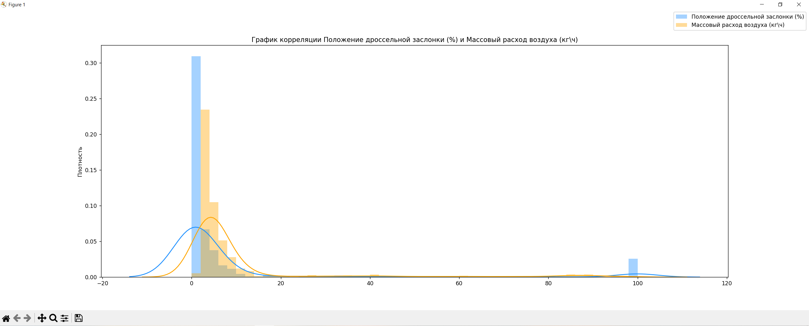

# OTCHET LAB 7

## Bài 1

Sau khi chạy function task_1 trong file lab7.py, tôi thu được kết quả như sau:

Như vậy, khi sử dụng Numpy để nhân `1000000`, tôi chỉ mất **0.019s**, trong khi nếu sử dụng mảng thường, tôi mất tận **5.068s**.

Có thể thấy sử dụng Numpy để tính toán các biểu thức đại số tuyến tính sẽ *nhanh* và *hiệu quả* lên rất nhiều.

## Bài 2

Chạy hàm `scatter_graph`, ta thu được đồ thị sau:

Từ đây, ta có thể rút ra các kết luận sau:
- Kết luận 1
- Kết luận 2
...

Chạy hàm `density_curve`, ta lại thu đồ thị sau:

Từ đây, ta có thể rút ra các kết luận sau:
1. Kết luận 1
2. Kết luận 2
...

