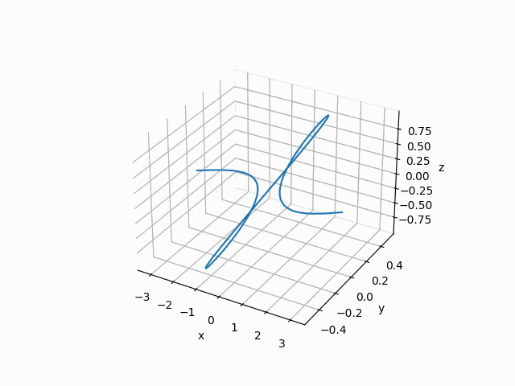
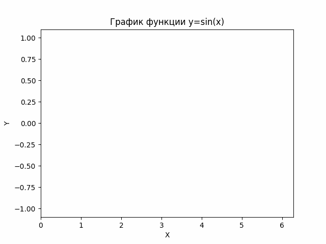

# OTCHET LAB 7

## Часть 1

После запуска функции task_1 в файле lab7.py я получил следующий вывод:

Таким образом, при использовании Numpy для  умножения «1000000» я теряю только **0,019 с**, а при использовании обычных массивов я получаю **5,068 с**.

Можно видеть, что использование Numpy для вычисления линейных алгебраических выражений будет *быстрым* и *эффективным*.

## Часть 2

Запустив функцию `scatter_graph`, мы получим следующий график:

Отсюда мы можем сделать следующие выводы:
- Глядя на график, мы видим, что значения двух графиков находятся на одном графике, каждая ось Y представляет разные единицы, просмотр также может распознать распределение каждой величины.

Запустив функцию `density_curve`, мы получим следующий график:

Отсюда мы можем сделать следующие выводы:
1. Гистограмма корреляции показывает распределение плотности каждого графика

## Часть 3

Получаем трехмерный график функции: "x∈(-п;п); y=sin(x)cos(x); z=sin(x)"

 

Создайте функцию `animate`, чтобы она выглядела как красивая анимация (это то, что я добавил, чтобы сделать лабораторную работу более красивой)

## Последняя часть (овертайм)

Создайте анимированный график для функции "y=sin(x)" 
Получаем следующий график:

 

